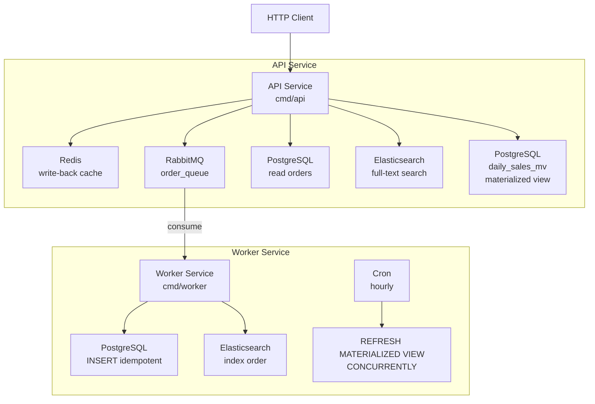
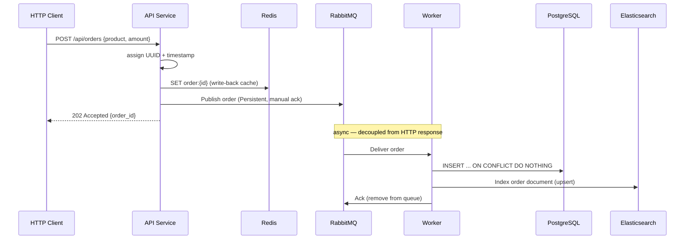
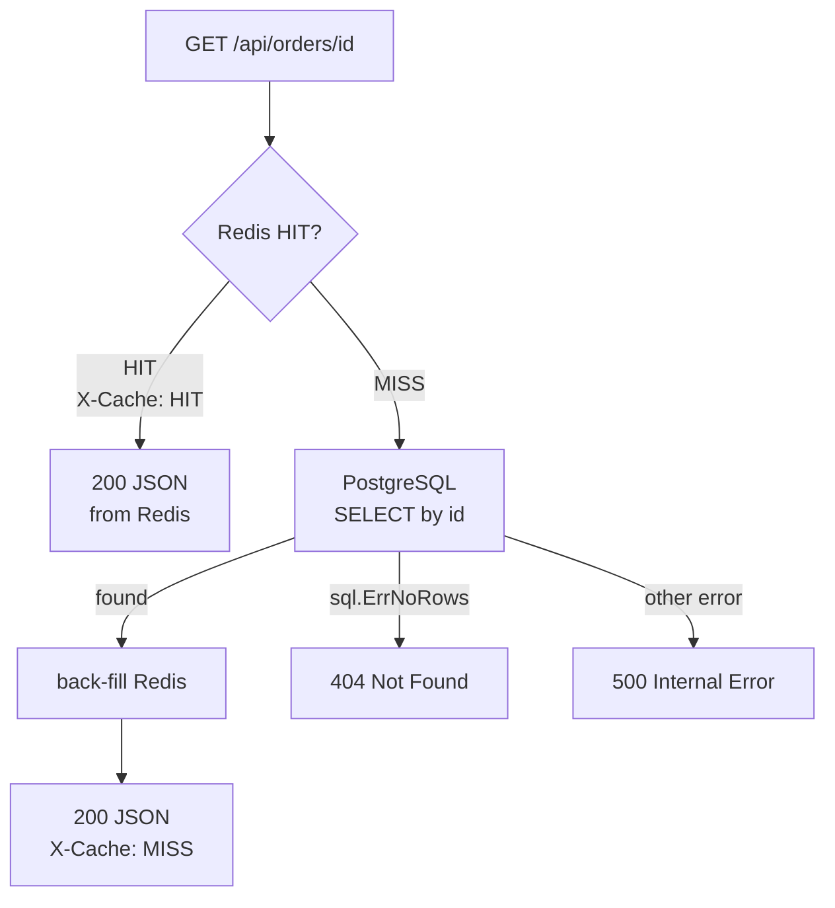
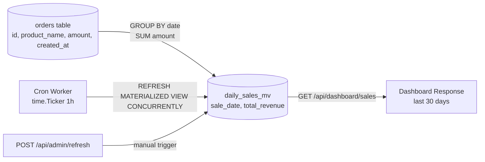

# go-polyglot-persistence

A Go project exploring **write-back caching**, **async persistence**, **full-text search**, and **materialized views** — all wired together with Redis, RabbitMQ, PostgreSQL, and Elasticsearch, running locally in Docker.

## Core Idea

The API never writes to Postgres directly. It writes to Redis immediately (so reads are instant), publishes to a queue, and a background worker handles durable persistence asynchronously.

---

## Architecture



---

## Write Path (POST /api/orders)



---

## Read Path (GET /api/orders/{id})



---

## Materialized View Refresh



The `CONCURRENTLY` keyword means reads on `daily_sales_mv` are **never blocked** during a refresh. It requires the unique index `daily_sales_mv_date_idx` on `sale_date`.

---

## Services

| Service | Port | Purpose |
|---------|------|---------|
| API | `:8080` | HTTP REST API |
| PostgreSQL | `:5432` | Source of truth |
| Redis | `:6379` | Write-back cache |
| RabbitMQ | `:5672` / `:15672` | Message queue (UI: guest/guest) |
| Elasticsearch | `:9200` | Full-text search |
| Kibana | `:5601` | ES UI |
| Prometheus | `:9090` | Metrics scrape |

---

## Project Structure

```
cmd/
  api/main.go          # Wires packages, starts HTTP server
  worker/main.go       # Wires packages, starts consume loop

internal/
  api/
    handlers.go        # One method per route; deps injected via interfaces
    routes.go          # Route table
  cache/               # Redis write-back cache
  config/              # Env var loading with docker-compose defaults
  database/            # PostgreSQL — all SQL, context timeouts on every op
  metrics/             # Prometheus histograms
  models/              # Shared types (Order, DailySale)
  queue/               # RabbitMQ Publisher + Consumer, manual ack
  search/              # Elasticsearch index + search
  worker/
    worker.go          # Consume loop, per-message 10s timeout
    cron.go            # Hourly materialized view refresh

init.sql               # Schema bootstrap (auto-run on first container start)
docker-compose.yml     # 7 services with healthchecks + named volumes
```

---

## Quickstart

```bash
docker compose up --build
```

```bash
# Create an order
curl -X POST http://localhost:8080/api/orders \
  -H "Content-Type: application/json" \
  -d '{"product_name": "Laptop", "amount": 999.99}'

# Get an order (Redis HIT after first fetch)
curl http://localhost:8080/api/orders/{id}

# Full-text search
curl "http://localhost:8080/api/search?q=laptop"

# Sales dashboard (reads from materialized view)
curl http://localhost:8080/api/dashboard/sales

# Manually refresh the materialized view
curl -X POST http://localhost:8080/api/admin/refresh

# Tear down and wipe all persisted data
docker compose down -v
```

---

## Further Reading

- **[docs/architecture.md](docs/architecture.md)** — data flows, write-back cache pattern, idempotency, materialized view design
- **[docs/ops.md](docs/ops.md)** — all env vars, graceful shutdown sequence, observability, example requests
